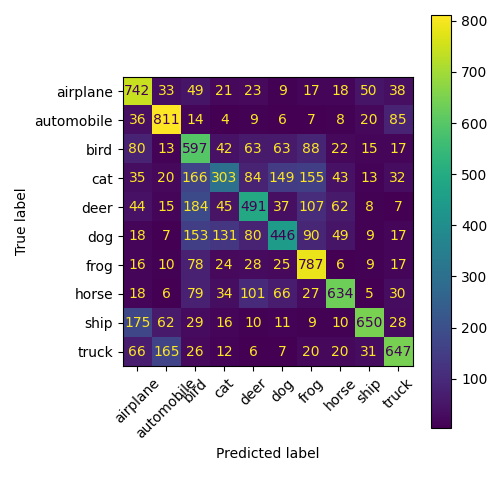

# Deep-Learning-with-Pytorch

A practical deep learning project using **PyTorch** to build and experiment with **Convolutional Neural Networks (CNNs)** for image classification.

## Dataset

**CIFAR-10** — 60,000 color images across 10 classes. 
There were two sets in CIFAR-10, train set and test set. Train set was further splitted into train and validation set. 

* 40,000 training images
* 10,000 validation images
* 10,000 test images

## Baseline CNN

The initial model consists of:

* 2 convolutional layers
* ReLU activation
* Max pooling
* 3 fully connected layers

**Training:** SGD, learning rate = 0.001, momentum = 0.9, total 10 Epochs.

## Results

| Metric                   |               Result |
| ------------------------ | -------------------: |
| Best Validation Accuracy | **60.99% (Epoch 9)** |
| Test Accuracy            |           **61.08%** |

## Next Steps to follow

* Improved CNN architectures
* Batch Normalization
* Dropout
* Data augmentation
* Learning-rate tuning

## Tools

**Python · PyTorch · Torchvision · Scikit-learn · Matplotlib · Google Colab**
